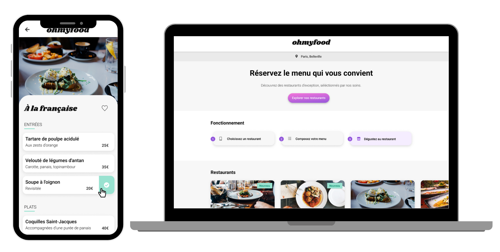

# Formation Développeur d'application JavaScript React

## Projet 3 : Dynamisez une page web avec des animations CSS

## Objectifs:

1. Développer un site présentant le menu de quatre grands restaurants parisiens.
2. Permettre la réservation en ligne et la composition de menus.
   Identité graphique:

## Polices:

● Logo et titres: Shrikhand

● Texte: Roboto

● Couleurs:

    - Primaire: #9356DC

    - Secondaire: #FF79DA

    - Tertiaire: #99E2D0

## Technologies utilisées:

HTML / SASS / CSS animations / FIGMA / Flexbox

J'ai intégré une maquette en mode mobile-first, en disposant des maquettes pour mobile et desktop ainsi que du prototype sur Figma, avec les images et textes nécessaires.

J'ai mis en œuvre des animations CSS pour enrichir l'expérience utilisateur du site. Ces animations ont donné vie à l'interface et ont rendu la navigation plus interactive et engageante.

Enfin, j'ai versionné mon projet avec Git et GitHub, renforçant ainsi mes compétences essentielles pour la gestion et la collaboration sur des projets de développement web.
